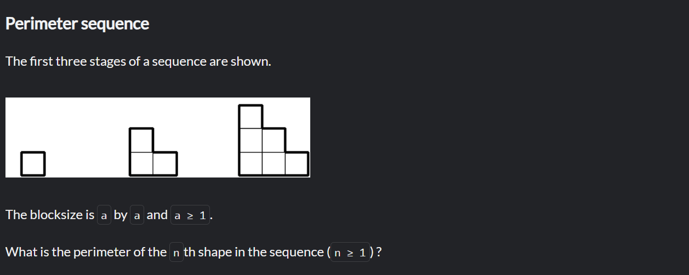

# Cv for the first stage

## Name: Darya Okrut

## About me:

Just some text about my education, goals and recent projects. This task is only for bot to read that's why I won't write here anything usefull.

## Skills:

- Java
- C++
- C#
- Wolfram
- _English_ (_B1+_)

## Code example:

### Task:

### Solution:

    function perimeterSequence(a,n) {
        return a*n*4;
    }
